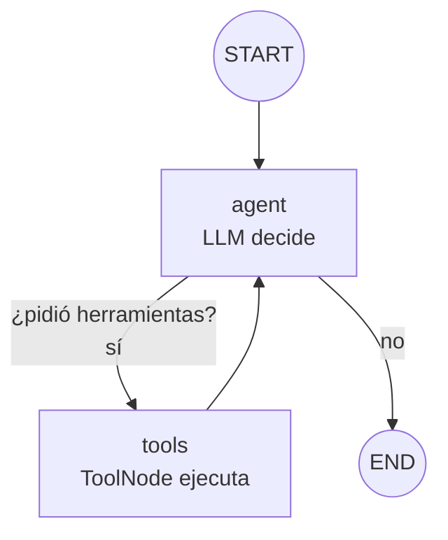
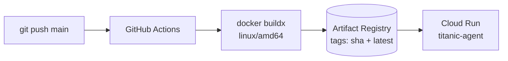

# 🚢 Titanic Agent — Agente de datos con LangGraph + LangChain

Un **agente de IA** que responde preguntas en lenguaje natural sobre el dataset del Titanic.
No inventa cifras: el modelo (Gemini) **decide qué herramientas de pandas usar**, las ejecuta,
lee los resultados y razona hasta llegar a una respuesta.

```text
Pregunta:  "¿Cuál fue la tasa de supervivencia de las mujeres?"
Agente:    schema() → survival_rate(group_by=["sex"])
Respuesta: "La tasa de supervivencia de las mujeres fue del 74.2 %."
```

El proyecto cubre el ciclo completo: **agente → API REST → contenedor Docker → despliegue automático
en Google Cloud Run → evaluación de precisión**.

---

## 📑 Índice

1. [¿Qué es un agente?](#-qué-es-un-agente)
2. [LangChain vs. LangGraph: ¿quién hace qué?](#-langchain-vs-langgraph-quién-hace-qué)
3. [Arquitectura](#-arquitectura)
4. [Estructura del proyecto](#-estructura-del-proyecto)
5. [Cómo funciona el código, paso a paso](#-cómo-funciona-el-código-paso-a-paso)
6. [Ejecutarlo en local](#-ejecutarlo-en-local)
7. [Usar la API](#-usar-la-api)
8. [Despliegue (CI/CD)](#-despliegue-cicd)
9. [Evaluación del agente](#-evaluación-del-agente)
10. [Cómo extenderlo](#-cómo-extenderlo)

---

## 🤖 ¿Qué es un agente?

Un LLM por sí solo **solo genera texto**: si le preguntas cuántos pasajeros sobrevivieron,
puede "recordar" un número… o inventarlo.

Un **agente** es un LLM al que se le da:

1. **Herramientas** (funciones de Python) que puede pedir ejecutar.
2. **Un bucle** que le devuelve el resultado de esas herramientas para que siga razonando.

Este patrón se conoce como **ReAct** (*Reason + Act*):

```text
 ┌──────────────┐   "necesito datos"    ┌──────────────┐
 │   Razonar    │ ────────────────────▶ │    Actuar    │
 │  (el LLM)    │                       │ (herramienta)│
 └──────────────┘ ◀──────────────────── └──────────────┘
        │            "aquí está el resultado"
        ▼
   Respuesta final (cuando ya tiene lo que necesita)
```

---

## 🧩 LangChain vs. LangGraph: ¿quién hace qué?

| Librería      | Rol en este proyecto                                                                 | Dónde verlo                         |
|---------------|--------------------------------------------------------------------------------------|-------------------------------------|
| **LangChain** | Conecta con el modelo (`init_chat_model`) y convierte funciones Python en herramientas (`@tool`). | `agent.py` — secciones 2 y final     |
| **LangGraph** | Orquesta el **flujo**: define nodos, aristas y el bucle agente ↔ herramientas como un grafo con estado. | `agent.py` — sección 3 (`build_graph`) |

> 💡 **Analogía:** LangChain te da las *piezas* (el cerebro y las manos); LangGraph es el
> *diagrama de flujo* que dice en qué orden se usan y cuándo terminar.

---

## 🏗️ Arquitectura

### Vista general del sistema

```mermaid
flowchart LR
    U[👤 Cliente<br/>curl / notebook] -->|POST /  JSON| API[Flask + Gunicorn<br/>main.py]
    API -->|ask&#40;question&#41;| G[Grafo LangGraph<br/>agent.py]
    G <-->|bind_tools| LLM[(Gemini<br/>vía LangChain)]
    G <--> T[Herramientas pandas]
    T --> D[(titanic.csv)]
    subgraph Cloud Run
      API
      G
      T
      D
    end
```



### El grafo del agente (LangGraph)



- **`agent`**: llama al LLM con el historial de mensajes. El LLM responde con texto *o* con una
  petición de herramienta (`tool_call`).
- **`tools_condition`**: arista condicional — si hay `tool_calls` va a `tools`; si no, termina.
- **`tools`**: `ToolNode` ejecuta las herramientas pedidas y añade los resultados al historial.
- El **estado** (`MessagesState`) es simplemente la lista de mensajes, que va creciendo en cada vuelta.

---

## 📁 Estructura del proyecto

```text
Langraph_Langchain_Agent/
├── .github/workflows/
│   └── deploy.yml        # CI/CD: build de la imagen + deploy en Cloud Run en cada push a main
├── ai_system/
│   ├── agent.py          # 🧠 El agente: dataset, herramientas y grafo LangGraph
│   ├── main.py           # 🌐 API Flask (POST / y GET /health)
│   ├── requirements.txt  # Dependencias fijadas
│   ├── Dockerfile        # Imagen Python 3.12 + Gunicorn
│   └── .dockerignore
└── Prediction.ipynb      # 📊 Notebook para probar y evaluar el agente desplegado
```

---

## 🔍 Cómo funciona el código, paso a paso

Todo el agente vive en [`ai_system/agent.py`](ai_system/agent.py), dividido en 4 secciones.

### 1. Dataset

```python
df = pd.read_csv(DATASET_URL)  # 891 pasajeros, se carga una sola vez al arrancar
```

Por defecto usa el CSV de seaborn; puede cambiarse con la variable de entorno `DATASET_URL`.

### 2. Herramientas (LangChain `@tool`)

El decorador `@tool` convierte una función en algo que el LLM puede "ver" y pedir.
**El docstring es crucial**: es lo que el modelo lee para decidir cuándo y cómo usarla.

| Herramienta           | Qué hace                                                        | Ejemplo de llamada                               |
|-----------------------|-----------------------------------------------------------------|--------------------------------------------------|
| `schema()`            | Columnas, tipos, nulos y 3 filas de muestra                     | `schema()`                                       |
| `statistics(column)`  | `describe()` si es numérica; frecuencias si es categórica       | `statistics(column="age")`                       |
| `survival_rate(group_by)` | Tasa de supervivencia y nº de pasajeros por grupos         | `survival_rate(group_by=["sex", "class"])`       |
| `filter_passengers(condition)` | Filtra con `df.query()` y devuelve conteo, tasa y muestra | `filter_passengers(condition="age < 18 and pclass == 3")` |

> 🛡️ **Errores como retroalimentación:** si el modelo pide una columna inexistente o escribe mal
> una condición, la herramienta **no lanza una excepción**: devuelve el error como texto.
> Así el LLM lo lee y se corrige en la siguiente vuelta.

Además, un **prompt de sistema** fija el comportamiento: *"eres un analista de datos, usa las
herramientas, nunca inventes cifras, consulta el esquema si no conoces las columnas"*.

### 3. El grafo (LangGraph)

```python
graph = StateGraph(MessagesState)
graph.add_node("agent", agent)              # nodo que llama al LLM
graph.add_node("tools", ToolNode(TOOLS))    # nodo que ejecuta herramientas

graph.add_edge(START, "agent")
graph.add_conditional_edges("agent", tools_condition)  # ¿tools o END?
graph.add_edge("tools", "agent")            # tras ejecutar, vuelve a razonar
```

Se compila **sin checkpointer**: cada petición a la API es una conversación nueva e independiente
(sin memoria entre preguntas).

### 4. Punto de entrada: `ask()`

```python
state = app.invoke({"messages": [HumanMessage(question)]}, {"recursion_limit": 25})
```

- `recursion_limit=25` evita bucles infinitos si el modelo nunca deja de pedir herramientas.
- Devuelve la respuesta final **y** la lista de herramientas usadas, útil para depurar y auditar.

### Ejemplo de traza real

```text
👤 HumanMessage:  "How many passengers survived?"
🤖 AIMessage:     tool_calls=[schema()]
🔧 ToolMessage:   "Rows: 891 ... survived int64 ..."
🤖 AIMessage:     tool_calls=[filter_passengers(condition="survived == 1")]
🔧 ToolMessage:   "Passengers: 342 ..."
🤖 AIMessage:     "A total of 342 passengers survived."   ← sin tool_calls → END
```

---

## 💻 Ejecutarlo en local

### Requisitos

- Python 3.12
- Una API key de Gemini ([Google AI Studio](https://aistudio.google.com/apikey))

### Opción A — Python

```bash
cd ai_system
python -m venv .venv && source .venv/bin/activate
pip install -r requirements.txt

export GEMINI_API_KEY="tu-api-key"
# opcional: export MODEL="google_genai:gemini-3.5-flash"

gunicorn --bind :8080 --workers 1 --threads 8 main:app
```

### Opción B — Docker

```bash
docker build -t titanic-agent ai_system/
docker run -p 8080:8080 -e GEMINI_API_KEY="tu-api-key" titanic-agent
```

### Probar el agente directamente en Python (sin API)

```python
from agent import ask
ask("What was the survival rate of first class passengers?")
```

### Variables de entorno

| Variable         | Obligatoria | Por defecto                          | Descripción                         |
|------------------|:-----------:|--------------------------------------|-------------------------------------|
| `GEMINI_API_KEY` | ✅          | —                                    | Clave del proveedor del modelo      |
| `MODEL`          | ❌          | `google_genai:gemini-3.5-flash`      | Modelo en formato `proveedor:modelo` |
| `DATASET_URL`    | ❌          | CSV del Titanic de seaborn           | Origen del dataset                  |
| `PORT`           | ❌          | `8080`                               | Puerto del servidor                 |

---

## 🌐 Usar la API

### `POST /` — Hacer una pregunta

```bash
curl -X POST http://localhost:8080/ \
  -H "Content-Type: application/json" \
  -d '{"question": "How many passengers survived?"}'
```

**Respuesta `200`:**

```json
{
  "answer": "A total of 342 passengers survived.",
  "tool_calls": [
    {"name": "schema", "args": {}},
    {"name": "filter_passengers", "args": {"condition": "survived == 1"}}
  ]
}
```

**Errores:**

| Código | Cuándo                                                              |
|:------:|---------------------------------------------------------------------|
| `400`  | El body no es JSON o falta `question`                               |
| `502`  | Falló el proveedor del modelo o el agente superó el límite de pasos |

### `GET /health` — Health check

```bash
curl http://localhost:8080/health   # {"status": "ok"}
```

---

## 🚀 Despliegue (CI/CD)

Cada `push` a `main` dispara [`.github/workflows/deploy.yml`](.github/workflows/deploy.yml):



1. Autentica en Google Cloud con el secreto `GCP_SA_KEY`.
2. Construye la imagen y la sube a **Artifact Registry** con el tag del commit y `latest`.
3. Despliega en **Cloud Run** (`us-central1`, 1 GiB de RAM, timeout 900 s, acceso público),
   inyectando `GEMINI_API_KEY` y `MODEL` como variables de entorno.

**Secretos necesarios en GitHub** (*Settings → Secrets and variables → Actions*):

| Secreto          | Contenido                                                      |
|------------------|----------------------------------------------------------------|
| `GCP_SA_KEY`     | JSON de una service account con permisos de Artifact Registry y Cloud Run |
| `GEMINI_API_KEY` | API key de Gemini                                              |

> ⚙️ **¿Por qué 1 worker y 8 threads?** El dataset y el modelo se cargan una sola vez por proceso.
> Con un único worker se ahorra memoria, y los threads permiten atender varias peticiones a la vez
> (la mayor parte del tiempo se pasa esperando la respuesta del LLM, que es I/O).

---

## 📊 Evaluación del agente

[`Prediction.ipynb`](Prediction.ipynb) consulta el agente desplegado y mide su calidad:

1. Define un **test set** de preguntas cuya respuesta correcta se calcula directamente con pandas
   (*ground truth*).
2. Envía cada pregunta a la API y extrae los números de la respuesta.
3. Marca como correcta la respuesta si algún número está dentro de un **1 %** del valor esperado.

**Resultados obtenidos** (11 preguntas, Gemini 3.5 Flash):

| Métrica                 | Valor          |
|-------------------------|----------------|
| Precisión               | **100 % (11/11)** |
| Latencia media          | 4.13 s         |
| Llamadas a herramientas | 3.09 de media por pregunta |

> 🧪 Evaluar un agente con *ground truth* calculado de forma determinista es una buena práctica:
> te permite cambiar de modelo, de prompt o de herramientas y comprobar objetivamente si mejora o empeora.

---

## 🛠️ Cómo extenderlo

### Añadir una herramienta nueva

```python
@tool
def correlation(col_a: str, col_b: str) -> str:
    """Pearson correlation between two numeric columns."""
    return f"{df[col_a].corr(df[col_b]):.3f}"

TOOLS = [schema, statistics, survival_rate, filter_passengers, correlation]
```

No hace falta tocar el grafo: `bind_tools` y `ToolNode` la recogen automáticamente.

### Cambiar de modelo / proveedor

Gracias a `init_chat_model`, basta con instalar el paquete del proveedor y cambiar `MODEL`:

```bash
pip install langchain-openai
export MODEL="openai:gpt-4o-mini"
export OPENAI_API_KEY="..."
```

### Añadir memoria de conversación

Compila el grafo con un *checkpointer* y pasa un `thread_id` en cada llamada:

```python
from langgraph.checkpoint.memory import InMemorySaver
app = graph.compile(checkpointer=InMemorySaver())
app.invoke({"messages": [...]}, {"configurable": {"thread_id": "usuario-123"}})
```

> ⚠️ En Cloud Run las instancias son efímeras: para memoria persistente usa un checkpointer
> con base de datos (p. ej. Postgres) en lugar de `InMemorySaver`.

### Usar otro dataset

Apunta `DATASET_URL` a otro CSV y adapta las herramientas y el prompt de sistema
(por ejemplo, `survival_rate` depende de la columna `survived`).

---

## 📚 Recursos

- [Documentación de LangGraph](https://langchain-ai.github.io/langgraph/)
- [Documentación de LangChain](https://python.langchain.com/)
- [Paper ReAct: Synergizing Reasoning and Acting in Language Models](https://arxiv.org/abs/2210.03629)
- [Google Cloud Run](https://cloud.google.com/run/docs)
