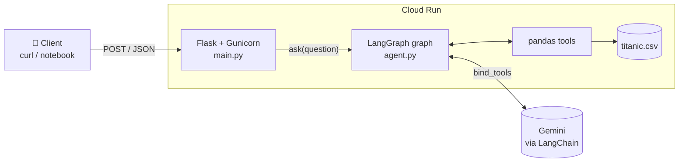
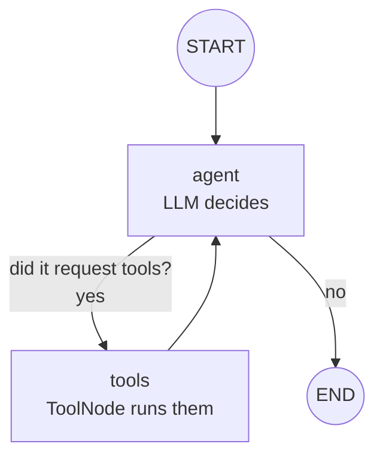
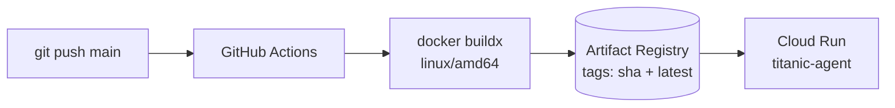

# 🚢 Titanic Agent — Data agent with LangGraph + LangChain

An **AI agent** that answers natural-language questions about the Titanic dataset.
It doesn't make up figures: the model (Gemini) **decides which pandas tools to use**, runs them,
reads the results and reasons until it reaches an answer.

```text
Question: "What was the survival rate of women?"
Agent:    schema() → survival_rate(group_by=["sex"])
Answer:   "The survival rate of women was 74.2%."
```

The project covers the full cycle: **agent → REST API → Docker container → automatic deployment
to Google Cloud Run → accuracy evaluation**.

---

## 📑 Table of contents

1. [What is an agent?](#-what-is-an-agent)
2. [LangChain vs. LangGraph: who does what?](#-langchain-vs-langgraph-who-does-what)
3. [Architecture](#️-architecture)
4. [Project structure](#-project-structure)
5. [How the code works, step by step](#-how-the-code-works-step-by-step)
6. [Running it locally](#-running-it-locally)
7. [Using the API](#-using-the-api)
8. [Deployment (CI/CD)](#-deployment-cicd)
9. [Evaluating the agent](#-evaluating-the-agent)
10. [How to extend it](#️-how-to-extend-it)

---

## 🤖 What is an agent?

An LLM on its own **only generates text**: if you ask it how many passengers survived,
it might "remember" a number… or make one up.

An **agent** is an LLM that is given:

1. **Tools** (Python functions) it can ask to run.
2. **A loop** that feeds the results of those tools back so it can keep reasoning.

This pattern is known as **ReAct** (*Reason + Act*):

```text
 ┌──────────────┐    "I need data"      ┌──────────────┐
 │    Reason    │ ────────────────────▶ │     Act      │
 │  (the LLM)   │                       │    (tool)    │
 └──────────────┘ ◀──────────────────── └──────────────┘
        │              "here's the result"
        ▼
   Final answer (once it has what it needs)
```

---

## 🧩 LangChain vs. LangGraph: who does what?

| Library       | Role in this project                                                                 | Where to see it                     |
|---------------|--------------------------------------------------------------------------------------|-------------------------------------|
| **LangChain** | Connects to the model (`init_chat_model`) and turns Python functions into tools (`@tool`). | `agent.py` — section 2 and the end  |
| **LangGraph** | Orchestrates the **flow**: defines nodes, edges and the agent ↔ tools loop as a stateful graph. | `agent.py` — section 3 (`build_graph`) |

> 💡 **Analogy:** LangChain gives you the *pieces* (the brain and the hands); LangGraph is the
> *flowchart* that says in what order they're used and when to stop.

---

## 🏗️ Architecture

### System overview



### The agent graph (LangGraph)



- **`agent`**: calls the LLM with the message history. The LLM replies with text *or* with a
  tool request (`tool_call`).
- **`tools_condition`**: conditional edge — if there are `tool_calls` it goes to `tools`; otherwise it ends.
- **`tools`**: `ToolNode` runs the requested tools and appends the results to the history.
- The **state** (`MessagesState`) is simply the list of messages, which grows on every turn.

---

## 📁 Project structure

```text
Langraph_Langchain_Agent/
├── .github/workflows/
│   └── deploy.yml        # CI/CD: build the image + deploy to Cloud Run on every push to main
├── ai_system/
│   ├── agent.py          # 🧠 The agent: dataset, tools and LangGraph graph
│   ├── main.py           # 🌐 Flask API (POST / and GET /health)
│   ├── requirements.txt  # Pinned dependencies
│   ├── Dockerfile        # Python 3.12 + Gunicorn image
│   └── .dockerignore
└── Prediction.ipynb      # 📊 Notebook to test and evaluate the deployed agent
```

---

## 🔍 How the code works, step by step

The whole agent lives in [`ai_system/agent.py`](ai_system/agent.py), split into 4 sections.

### 1. Dataset

```python
df = pd.read_csv(DATASET_URL)  # 891 passengers, loaded only once at startup
```

By default it uses the seaborn CSV; it can be changed with the `DATASET_URL` environment variable.

### 2. Tools (LangChain `@tool`)

The `@tool` decorator turns a function into something the LLM can "see" and request.
**The docstring is crucial**: it's what the model reads to decide when and how to use it.

| Tool                  | What it does                                                    | Example call                                     |
|-----------------------|-----------------------------------------------------------------|--------------------------------------------------|
| `schema()`            | Columns, types, nulls and 3 sample rows                         | `schema()`                                       |
| `statistics(column)`  | `describe()` if numeric; frequencies if categorical             | `statistics(column="age")`                       |
| `survival_rate(group_by)` | Survival rate and passenger count by group                  | `survival_rate(group_by=["sex", "class"])`       |
| `filter_passengers(condition)` | Filters with `df.query()` and returns count, rate and a sample | `filter_passengers(condition="age < 18 and pclass == 3")` |

> 🛡️ **Errors as feedback:** if the model asks for a column that doesn't exist or writes a
> malformed condition, the tool **doesn't raise an exception**: it returns the error as text.
> That way the LLM reads it and corrects itself on the next turn.

In addition, a **system prompt** sets the behavior: *"you are a data analyst, use the
tools, never make up figures, check the schema if you don't know the columns"*.

### 3. The graph (LangGraph)

```python
graph = StateGraph(MessagesState)
graph.add_node("agent", agent)              # node that calls the LLM
graph.add_node("tools", ToolNode(TOOLS))    # node that runs tools

graph.add_edge(START, "agent")
graph.add_conditional_edges("agent", tools_condition)  # tools or END?
graph.add_edge("tools", "agent")            # after running, go back to reasoning
```

It's compiled **without a checkpointer**: each API request is a new, independent conversation
(no memory between questions).

### 4. Entry point: `ask()`

```python
state = app.invoke({"messages": [HumanMessage(question)]}, {"recursion_limit": 25})
```

- `recursion_limit=25` prevents infinite loops if the model never stops requesting tools.
- It returns the final answer **and** the list of tools used, which is useful for debugging and auditing.

### Real trace example

```text
👤 HumanMessage:  "How many passengers survived?"
🤖 AIMessage:     tool_calls=[schema()]
🔧 ToolMessage:   "Rows: 891 ... survived int64 ..."
🤖 AIMessage:     tool_calls=[filter_passengers(condition="survived == 1")]
🔧 ToolMessage:   "Passengers: 342 ..."
🤖 AIMessage:     "A total of 342 passengers survived."   ← no tool_calls → END
```

---

## 💻 Running it locally

### Requirements

- Python 3.12
- A Gemini API key ([Google AI Studio](https://aistudio.google.com/apikey))

### Option A — Python

```bash
cd ai_system
python -m venv .venv && source .venv/bin/activate
pip install -r requirements.txt

export GEMINI_API_KEY="your-api-key"
# optional: export MODEL="google_genai:gemini-3.5-flash"

gunicorn --bind :8080 --workers 1 --threads 8 main:app
```

### Option B — Docker

```bash
docker build -t titanic-agent ai_system/
docker run -p 8080:8080 -e GEMINI_API_KEY="your-api-key" titanic-agent
```

### Trying the agent directly in Python (no API)

```python
from agent import ask
ask("What was the survival rate of first class passengers?")
```

### Environment variables

| Variable         | Required | Default                              | Description                         |
|------------------|:--------:|--------------------------------------|-------------------------------------|
| `GEMINI_API_KEY` | ✅       | —                                    | Model provider key                  |
| `MODEL`          | ❌       | `google_genai:gemini-3.5-flash`      | Model in `provider:model` format    |
| `DATASET_URL`    | ❌       | seaborn's Titanic CSV                | Dataset source                      |
| `PORT`           | ❌       | `8080`                               | Server port                         |

---

## 🌐 Using the API

### `POST /` — Ask a question

```bash
curl -X POST http://localhost:8080/ \
  -H "Content-Type: application/json" \
  -d '{"question": "How many passengers survived?"}'
```

**`200` response:**

```json
{
  "answer": "A total of 342 passengers survived.",
  "tool_calls": [
    {"name": "schema", "args": {}},
    {"name": "filter_passengers", "args": {"condition": "survived == 1"}}
  ]
}
```

**Errors:**

| Code  | When                                                                 |
|:-----:|----------------------------------------------------------------------|
| `400` | The body isn't JSON or `question` is missing                         |
| `502` | The model provider failed or the agent exceeded its step limit       |

### `GET /health` — Health check

```bash
curl http://localhost:8080/health   # {"status": "ok"}
```

---

## 🚀 Deployment (CI/CD)

Every `push` to `main` triggers [`.github/workflows/deploy.yml`](.github/workflows/deploy.yml):



1. Authenticates to Google Cloud with the `GCP_SA_KEY` secret.
2. Builds the image and pushes it to **Artifact Registry** tagged with the commit SHA and `latest`.
3. Deploys to **Cloud Run** (`us-central1`, 1 GiB RAM, 900 s timeout, public access),
   injecting `GEMINI_API_KEY` and `MODEL` as environment variables.

**Required GitHub secrets** (*Settings → Secrets and variables → Actions*):

| Secret           | Contents                                                       |
|------------------|----------------------------------------------------------------|
| `GCP_SA_KEY`     | JSON key of a service account with Artifact Registry and Cloud Run permissions |
| `GEMINI_API_KEY` | Gemini API key                                                 |

> ⚙️ **Why 1 worker and 8 threads?** The dataset and the model are loaded once per process.
> A single worker saves memory, and the threads let it serve several requests at once
> (most of the time is spent waiting for the LLM's response, which is I/O).

---

## 📊 Evaluating the agent

[`Prediction.ipynb`](Prediction.ipynb) queries the deployed agent and measures its quality:

1. Defines a **test set** of questions whose correct answer is computed directly with pandas
   (*ground truth*).
2. Sends each question to the API and extracts the numbers from the answer.
3. Marks the answer as correct if any number is within **1%** of the expected value.

**Results** (11 questions, Gemini 3.5 Flash):

| Metric                  | Value          |
|-------------------------|----------------|
| Accuracy                | **100% (11/11)** |
| Average latency         | 4.13 s         |
| Tool calls              | 3.09 on average per question |

> 🧪 Evaluating an agent against deterministically computed ground truth is good practice:
> it lets you change the model, prompt or tools and objectively check whether things get better or worse.

---

## 🛠️ How to extend it

### Adding a new tool

```python
@tool
def correlation(col_a: str, col_b: str) -> str:
    """Pearson correlation between two numeric columns."""
    return f"{df[col_a].corr(df[col_b]):.3f}"

TOOLS = [schema, statistics, survival_rate, filter_passengers, correlation]
```

No need to touch the graph: `bind_tools` and `ToolNode` pick it up automatically.

### Switching model / provider

Thanks to `init_chat_model`, you just install the provider's package and change `MODEL`:

```bash
pip install langchain-openai
export MODEL="openai:gpt-4o-mini"
export OPENAI_API_KEY="..."
```

### Adding conversation memory

Compile the graph with a *checkpointer* and pass a `thread_id` on each call:

```python
from langgraph.checkpoint.memory import InMemorySaver
app = graph.compile(checkpointer=InMemorySaver())
app.invoke({"messages": [...]}, {"configurable": {"thread_id": "user-123"}})
```

> ⚠️ Cloud Run instances are ephemeral: for persistent memory, use a database-backed checkpointer
> (e.g. Postgres) instead of `InMemorySaver`.

### Using another dataset

Point `DATASET_URL` to another CSV and adapt the tools and the system prompt
(for example, `survival_rate` depends on the `survived` column).

---

## 📚 Resources

- [LangGraph documentation](https://langchain-ai.github.io/langgraph/)
- [LangChain documentation](https://python.langchain.com/)
- [ReAct paper: Synergizing Reasoning and Acting in Language Models](https://arxiv.org/abs/2210.03629)
- [Google Cloud Run](https://cloud.google.com/run/docs)
